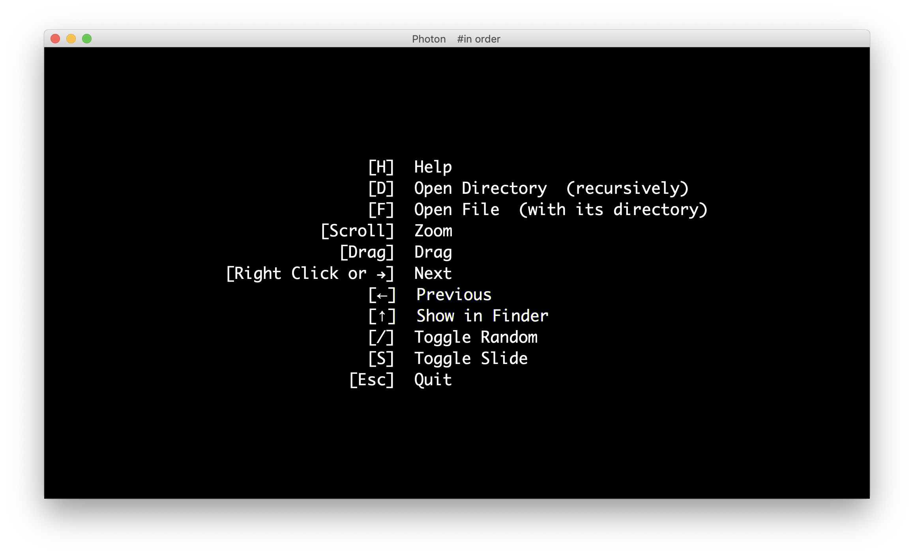

# Photon

  

Photon is a concise photo viewer implemented by myself using JavaFX.

Particularly on MacOS, comparing to the "preview.app", Photon supports viewing photos randomly and recursively with incredible smoothness. Here are some screenshots:

    

  		  
	

    

  		  
	

    

  		  
	

Several *new features* are still under developing, like:

- Image preloading
- More intelligent file format judging