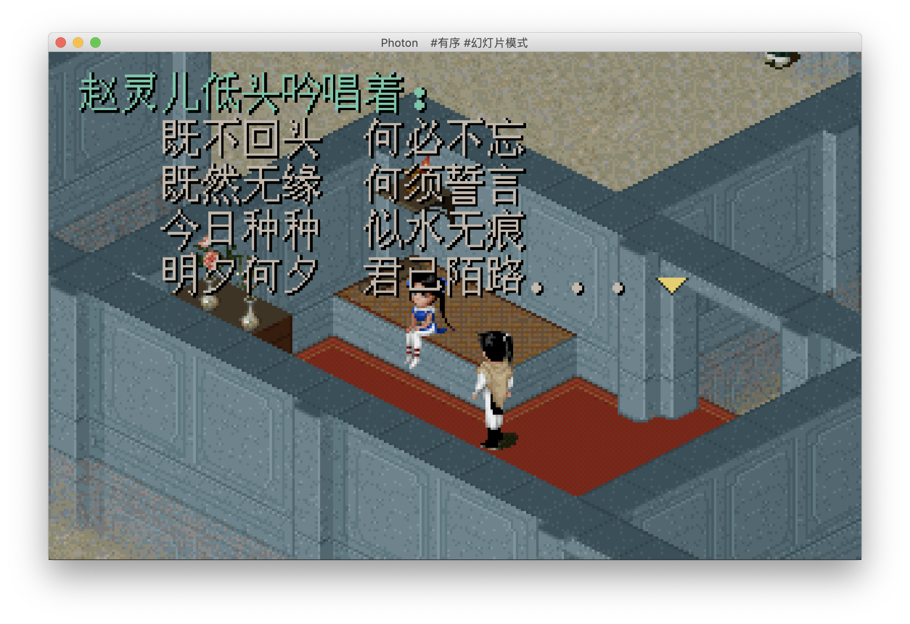

# Photon

Photon is a concise photo viewer implemented by Java using JavaFX.

Particularly on MacOS, unlike the "preview" app, Photon supports viewing photos randomly and recursively (in folder).

Several new features like are under developing.

Here are some screenshots:

    

  		  
	

    

  		  
	

